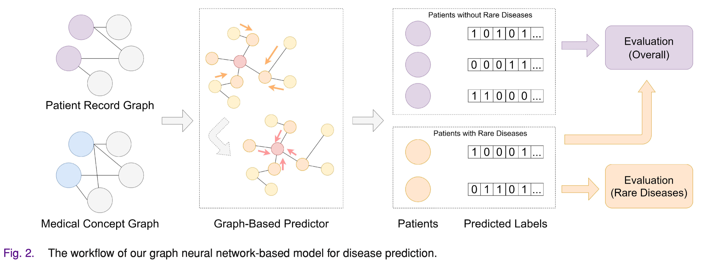

# Reproducibility homework for CS598DLH: Disease Prediction via Graph Neural Networks

We present the code for reproducing the paper [Disease Prediction via Graph Neural Networks](https://ieeexplore.ieee.org/document/9122573). This repository is adapted on the basis of the [official repository](https://github.com/zhchs/Disease-Prediction-via-GCN).



## Requirement
```
python >=3.6
pytorch
numpy
sklearn
```

## Dataset

| filename                    | content                                                      |
| --------------------------- | ------------------------------------------------------------ |
| ``filename.nodes.pkl``      | a list of all patient nodes                                  |
| ``filename.adj.pkl``        | adjacency list of all nodes in the graph                     |
| ``filename.rare.label.pkl`` | integer ids of rare-disease patients                         |
| ``filename.label.pkl``      | multiclass labels of all patient nodes and disease nodes (stacked), where the labels for the patients are their diseases, and that of the diseases are one-hot vectors |
| ``filename.map.pkl``        | mapping from strings (patient/symptom/disease identifiers) to integers |
| ``filename.train.pkl``      | integer ids of training nodes                                |
| ``filename.test.pkl``       | integer ids of testing nodes                                 |


## Example commands for experiments

1. Reproducing the results in the paper using the best set of hyperparameters

```bash
python run_multi.py
```

2. Reproducing the results in the paper with other hyperparameters

```bash
python run_multi.py --f-dim [input feature dimension] \
										--n-neighbors [number of neighbors to aggregate on] \
										--enc-dim [dimension of embedding layers] \
										--train-enc-num [number of aggregator layers] \
										--n-epochs [number of training epochs] \
										--lr [learning rate] \
										--bs [batch size]
```

After training is finished, the evaluations will be automatically conducted on both general and rare diseases, based on the evaluation metric of *precision*, *recall*, and *F-1 score*.

The training losses will be saved to a local file.

## References

```tex
@article{sun2020disease,
  title={Disease prediction via graph neural networks},
  author={Sun, Zhenchao and Yin, Hongzhi and Chen, Hongxu and Chen, Tong and Cui, Lizhen and Yang, Fan},
  journal={IEEE Journal of Biomedical and Health Informatics},
  volume={25},
  number={3},
  pages={818--826},
  year={2020},
  publisher={IEEE}
}
```

